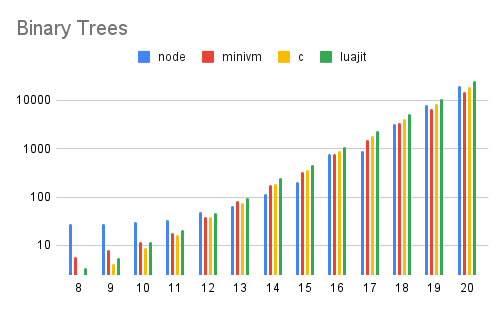

# MiniVM

[](https://discord.gg/UyvxuC5W5q)

**MiniVM is a small and fast cross-language Virtual Machine (VM) written in good ol' C**, meaning it can compile and run just about anywhere. Here are a few reasons why MiniVM is pretty neat:

- Built on a register-based ISA that beats luajit—*with the JIT on*—in some benchmarks. (See the [benchmarks](#benchmarks) section below).
- Has an efficient GC that can handle large amounts of allocations and deallocations efficiently. (Again, check the benchmarks).
- Supports a flexible data model with a number of optimizations to minimize memory usage.
- Leverages Cosmopolitan libc + WebAssembly for easy cross platform portability.
- ... check out the [details](#some-sweet-deets) section for more!

MiniVM is small and flexible enough to run just about any language under the sun (given you've taken the time to write a compiler for it). Front ends we've experimented with include Lua, Scheme, Paka, and others. You can try out the [Paka frontend to MiniVM online](https://fastvm.github.io/xori)!

## History
This project started as an exploration into what it takes to build a fast interpreters. The first version was blocked out during a single Discord call, and ran a small lisp-like language.

This original implementation was a plain stack machine, which, for whatever reason, was a tad faster than it should've been. Leveraging this tiny 1,000 LoC base, MiniVM matured into something a bit bigger, but only slightly. It now runs a language close to ASM, and has gotten quite a lot faster over time. MiniVM's speed is in no small part due to its architecture. It's a register/stack machine with carefully-selected opcodes that are designed to work well with common data-access patterns.

Above all else, MiniVM is a constantly improving each day. We hope you find the journey to be as interesting as the final destination. If you're interested as to where the project is headed next, ping Shaw (`@4984#4984`) on [the Discord Server](https://discord.gg/UyvxuC5W5q).

## Some Sweet Deets
Below is a small discussion of the architecture of MiniVM, and the emergent properties because of these decisions.

### A Register-Based VM
First and foremost, MiniVM is a register-based VM. This means that instructions are larger and operate on *registers*, as opposed to the *stack*. Because of this property, register-based VMs play nicely with modern hardware, and result in less instructions per unit of work done. Consider the following:

```
while x < 1000 {
  x = x + 1
}
```

A stack-based VM would have to emit a single instruction for every single little thing done in the loop above. You'd probably end up with something like:

```
head_of_loop:
  load_var x
  push_int 1000
  less_than
  jump_if_false :end_of_loop
  load_var x
  increment
  store_var x
end_of_loop:
```

This is all well and good, but compare it to what a register-based machine does:

```
// r0 is where x lives
head_of_loop:
  jump_if_reg_less_than_number r0 1000 :end_of_loop
  increment_reg r0 1
  jump :head_of_loop
end_of_loop:
```

Although each instruction is a bit more complex, there are way fewer instructions. And this per-instruction complexity isn't necessarily a bad thing: making instructions more complex offloads work to the host language (C, in this case), which means that the runtime can compile common complex instructions to efficient native code.

### On `malloc` and `putchar`

MiniVM's only dependencies are [9 functions](https://github.com/FastVM/minivm/blob/main/vm/libc.h) in `libc`:

```
fmod, putchar, malloc, realloc, free, fopen, fclose, fwrite, fread
```

Only `malloc` and `putchar` are relied on heavily, though:

> `putchar` is the function all IO boils down to eventually.
> `malloc` is required for memory allocations as of recent.
>
> — Shaw

The entire codebase is highly configurable, allowing users of MiniVM to choose the optimal feature set that supports their application.

### Types

Minivm has a select set of core types. 

- none
  - the lack of a value
- boolean
  - true or false
- number
  - configurable to be C's `int32_t num: 30;` or C's `double num;`
- array
  - unchanging in length
  - mutable by default

Because MiniVM is a register-based machine, it employs clever instructions to leverage common type layouts for better performance. For instance, to emulate closures arrays can be called as functions if the first item in that array is a function.

## Installation
Building from source is pretty simple:

```
git clone https://github.com/shawsumma/minivm
cd minivm
make
```

One can also use the artifacts from github actions.

[MiniVM Binaries](https://github.com/FastVM/minivm/actions) for Linux, MacOS and Windows can be found here. Click the text next to a green check mark and download the linux-opt, macos-opt or windows-opt single file binary.

## Getting Started
MiniVM has a growing and fairly unstable API.
The best way to get familliar with MiniVM and its opcodes is to read through the headers in the `vm/` directory.

The top of the bytecode file is the usual entry point. MiniVM can be build as a library with `make VM_MAIN=`.

The most common way to get code running on MiniVM is to use [Paka](https://github.com/fastvm/paka). For those looking to try paka and minivm online use [XorI](https://fastvm.github.io/xori).

## Benchmarks
Taking benchmarks is hard. Benchmarks are fraught with peril and don't always tell the full story: if you want to know how your application will perform in a language, no benchmarks will be a substitute for that. We tried to be fair, methodical, and thorough in our benchmarking; despite this, remember to take these results with a grain of salt.

All benchmarks were run in hyperfine on a `2020 MacBook Air M1` with `8GB RAM` running `Big Sur 11.2.3`. The implementations we benchmarks are idiomatic and consistent between target benchmark languages. All benchmarks may be found in the [Paka repository](https://github.com/FastVM/paka/tree/main/bench) if you'd like to run them on your machine.

### Binary Trees: Allocations and GC


As you can see, MiniVM (no JIT) beats luajit with the JIT on in this benchmark. MiniVM has a custom-built allocator and GC, which beats out luajit's slower modified version of `malloc`. MiniVM also is a hair faster that C for tree sizes above 13 (C is compiled ahead-of time, using `clang` with the `-Ofast` flag for best performance). For tree sizes less that 13, beats Node JS due to having a faster startup time. Overall, MiniVM's performance is about on par with JIT'd and compiled languages on this benchmark.

The binary tree benchmark measures the time it takes to create a balanced binary tree of a given depth and sum the values in each node to produce a total for the tree. This measures how well the language runtime handles a large number of repeated allocations and deallocations (no memory pooling is used or allowed).

### Recursive Fibonacci: Functions and Math


As you can see, `minivm` (no JIT) is a hair slower than Node JS (JIT) but beats `luajit --joff` by a fair margin (no JIT).

The recursive fibonacci benchmark computes `fib(35)` in a recursive manner (not memoized). This mostly measures the performance of basic mathematical operations and the overhead of function calls. The code for `fib` in Paka (a minivm frontend) is:

```
def fib(n) {
    if n < 2 {
        return n
    } else {
        return fib(n - 1) + fib(n - 2)
    }
}
```

We compile this Paka straight to minivm bytecode, there isn't any subsequent optimization of the bytecode by hand.

## Roadmap
- Write assembler for minivm bytecode.
- Reducde dependencies to `libc` functions.
- Add types.
- Improve performance.

> Note: MiniVM is wholly developed by [Shaw](https://github.com/ShawSumma) (4984); this README was written by a [friend](https://github.com/slightknack) of his who thinks he can be a bit too modest at times.
